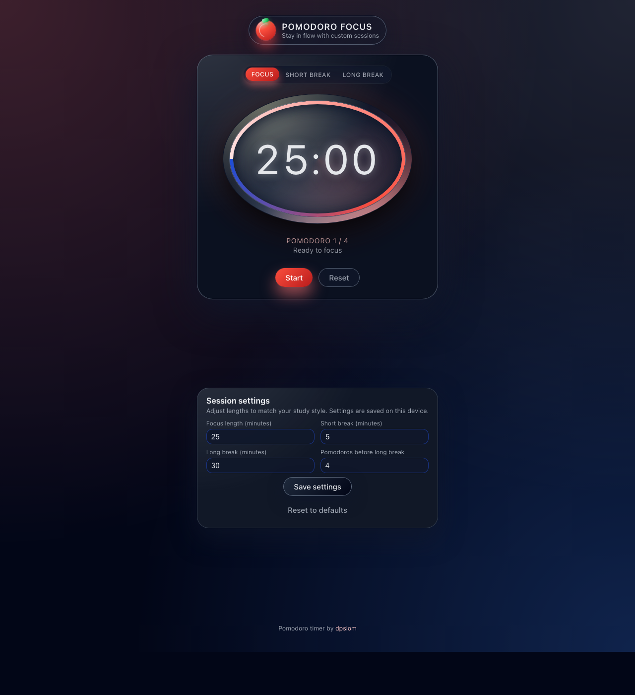

# Pomodoro Focus Timer

Responsive Pomodoro timer for desktop, tablet, and mobile.
Built as a static React app loaded from CDNs, with configurable sessions, browser notifications, sound alerts, and optional screen wake support.



## Features

- Focus, short break, and long break modes
- Default 25 / 5 / 30 minute session lengths
- Automatic long break after 4 completed focus sessions
- Custom session lengths and cycle length saved to `localStorage`
- Audio chime when a session ends
- Browser notifications when supported and permitted
- Screen Wake Lock support on compatible browsers
- Clean oval timer UI optimized for wide timer text

## Tech stack

- React 18 via CDN
- ReactDOM 18 via CDN
- Babel Standalone for in-browser JSX compilation
- Plain CSS for layout, styling, and timer ring rendering
- Static hosting friendly deployment model

## Project structure

```text
index.html         Entry point
app.js             Timer logic and React UI
style.css          Main styles
timer-theme.css    Timer sizing variables
config.js          Runtime UI toggles
favicon.svg        App icon
Dockerfile         Static nginx image
docs/
  app-screenshot.png
.github/
  workflows/
    docker-publish.yml
```

## Run locally

Serve the project from the repo root:

```bash
python3 -m http.server 8000
```

Then open:

```text
http://localhost:8000
```

Opening `index.html` directly can work, but browser features such as notifications are more reliable over `http://localhost`.

## Configuration

`config.js` exposes a small runtime toggle:

```js
window.POMODORO_UI = {
  showTechPanel: true,
};
```

Set `showTechPanel: false` to hide the "Notifications & screen" panel.

## Using the app

1. Open the app in your browser.
2. Adjust session settings if you want something other than the defaults.
3. Click `Start` to begin the timer.
4. Let the app cycle automatically between focus and break sessions, or switch modes manually with the tabs.

## Notifications and wake lock

- The app requests browser notification permission only when you click the enable button in the optional tech panel.
- On supported browsers, it uses the Screen Wake Lock API while the timer is running.
- On iPad or iPhone, setting `Auto-Lock` to `Never` may still help during long sessions.

## Docker

Build and run the included nginx image:

```bash
docker build -t pomodoro-timer:local .
docker run --rm -p 8080:80 pomodoro-timer:local
```

Then open:

```text
http://localhost:8080
```

The container image copies only the runtime files needed to serve the app.

## Deploy

This app is static, so it can be hosted on platforms such as:

- GitHub Pages
- AWS Amplify Hosting
- S3 + CloudFront
- Any nginx-based container or static file host

The repo also includes a GitHub Actions workflow at `.github/workflows/docker-publish.yml` for publishing a container image to GitHub Container Registry.
