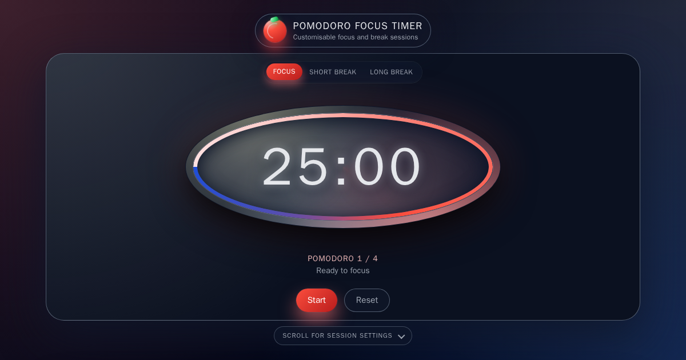

# Pomodoro Focus Timer

A responsive Pomodoro timer for desktop, tablet, and mobile, deployed at
[pomodoro.iomdev.com](https://pomodoro.iomdev.com/). The production build is pre-rendered for
fast, crawlable initial HTML and hydrates into an interactive React application.



## Features

- Focus, short-break, and long-break modes
- Configurable session lengths stored in the browser
- Automatic long break after a configurable number of focus sessions
- Audio, browser notification, and Screen Wake Lock support
- Responsive layout and visible deployed release version
- Pre-rendered H1 and SEO metadata, sitemap, robots file, and structured data

## Requirements

- Node.js 22 (`.nvmrc` is provided)
- npm 11 or a compatible npm version
- Chromium for browser and Lighthouse checks

## Development

```bash
nvm use
npm ci
npm run setup:browsers
npm run dev
```

The development server prints its local URL. The most useful commands are:

```bash
npm run lint          # Static checks
npm test              # Unit tests
npm run build         # Vite build plus React pre-render
npm run test:browser  # Runtime, responsive, and crawlability checks
npm run test:seo      # Lighthouse thresholds
npm run check         # Complete local/CI suite
```

The production output is generated in `dist/` and is intentionally not committed.

## Architecture

- `src/App.jsx` contains the React timer and settings UI.
- `src/timer.js` contains independently tested timer utilities.
- `scripts/prerender.jsx` injects the initial React markup into the Vite output.
- `public/` contains crawl discovery files, icons, the manifest, and social preview.
- `package.json` is the single source for the visible application version.

## Deployment

AWS Amplify monitors `main`. The checked-in `amplify.yml` installs pinned dependencies, runs
the production build, and publishes `dist/`. After a deployment, the footer version and the
live `robots.txt`/`sitemap.xml` endpoints provide quick release and crawlability checks.

The Docker workflow also publishes the same build to GitHub Container Registry as `latest`,
the package semantic version, and a commit-SHA tag after the `main` quality workflow passes.

## Contribution workflow

All changes start from a prioritised, labelled GitHub issue and are delivered through a pull
request. See `AGENTS.md` for the exact agent and release requirements.
